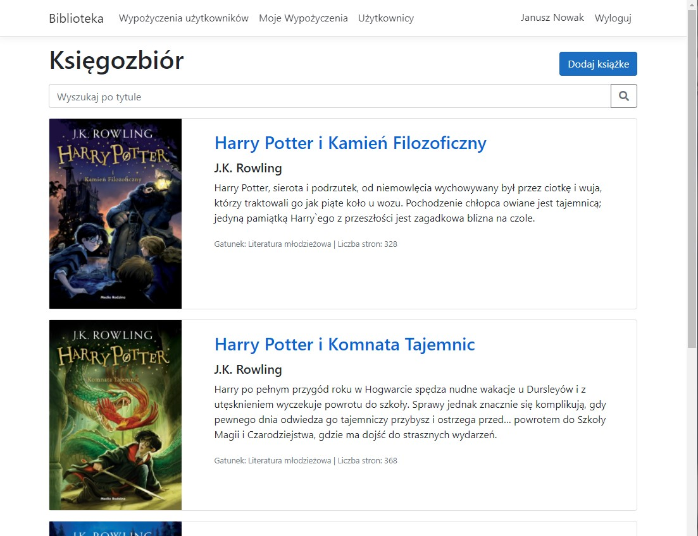
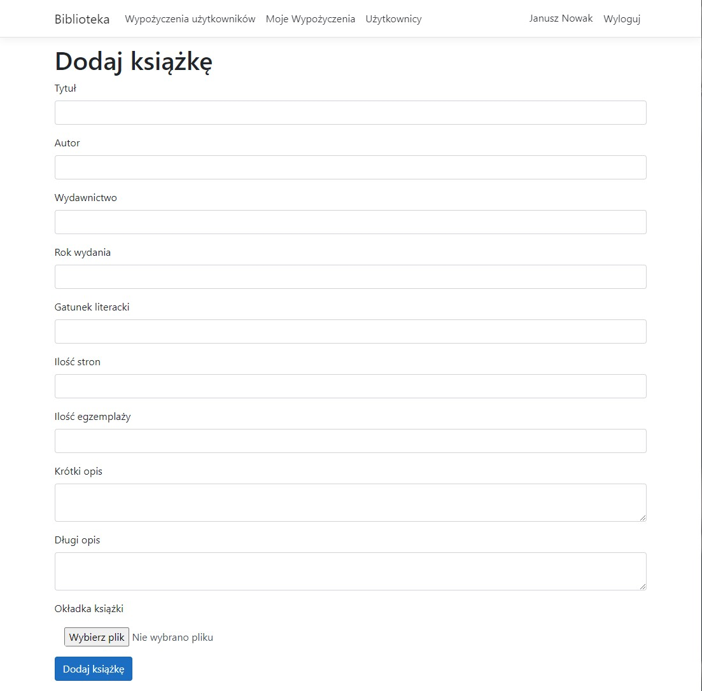
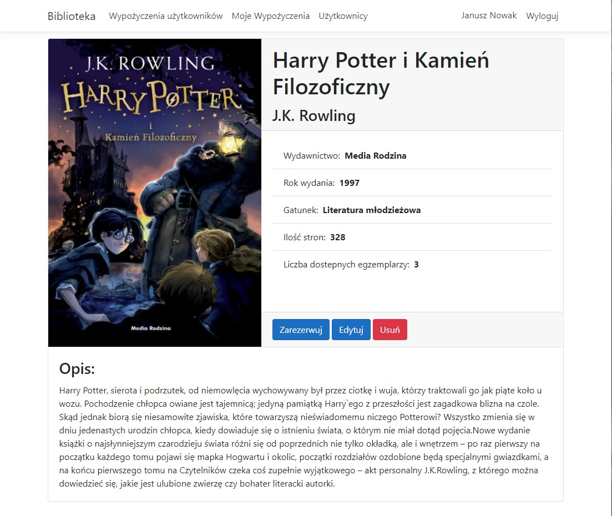
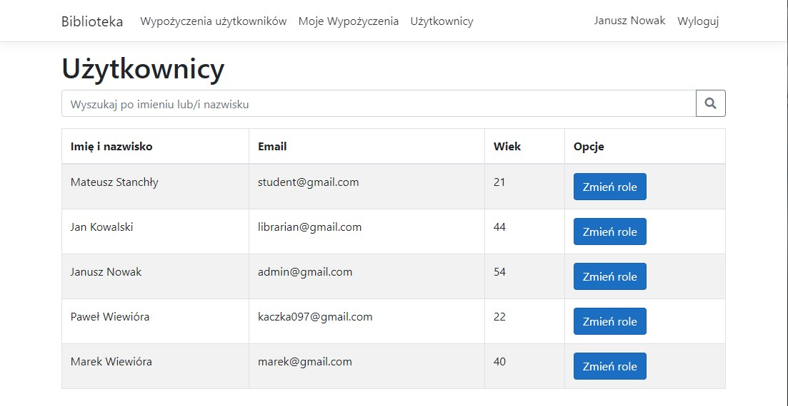
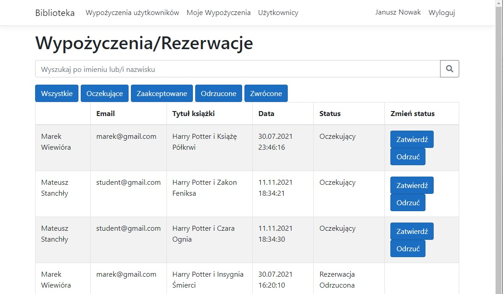

# Library
An ASP.NET MVC app simulating library work. App has been created for student internship.

## Technologies
Project is created with:
* ASP.NET 5.0
* Entity Framework Core 5.0
* Bootstrap 4.3

## Features
1. Books list view.

2. Adding, editing and removing book.

3. Book details view.

4. Managing users.

5. Managing book rental.

## Authors
* Paweł Wiewióra
* Damian Rękorajski
* Damian Piotrowski
* Mateusz Pokorny
* Mateusz Cogiel
